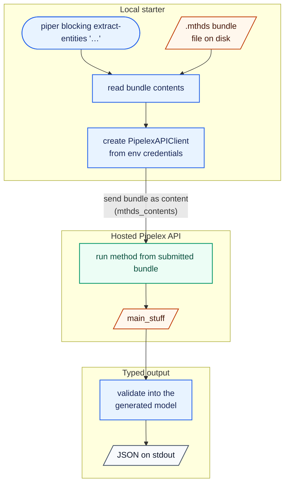
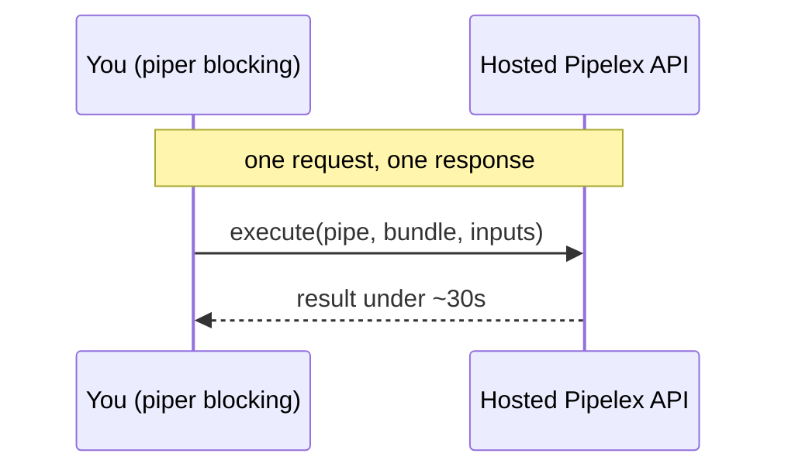
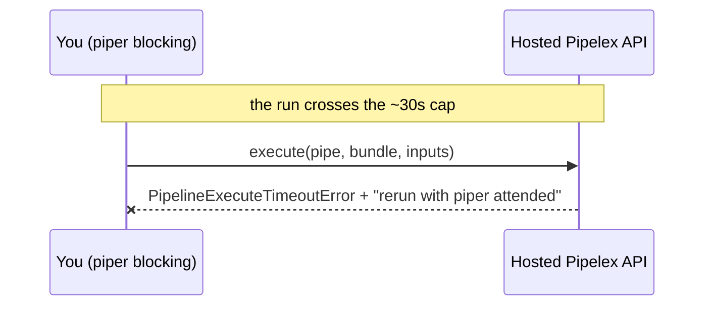
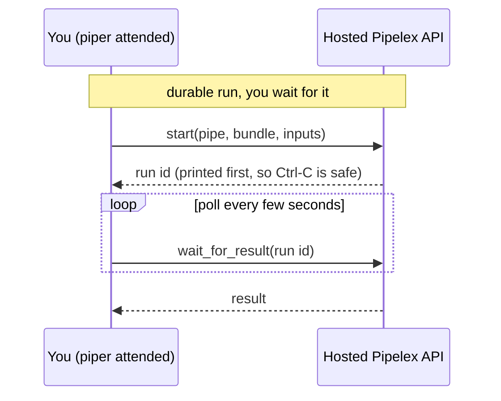
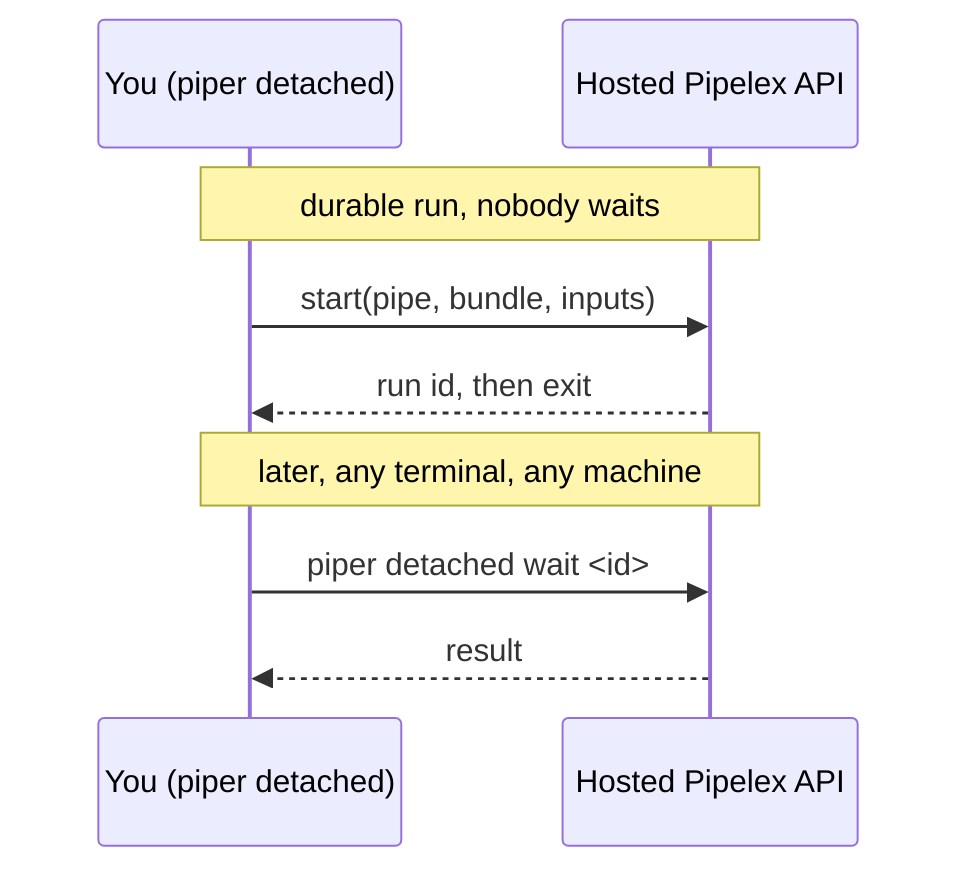

# Piper ⚡️

*Replace "Piper" with your actual project name*

A minimal Python CLI starter that calls the [Pipelex](https://pipelex.com) API via the [`pipelex-sdk`](https://pypi.org/project/pipelex-sdk/) SDK to run AI methods (`.mthds` bundles) — no local Pipelex runtime required.

It ships a handful of demo methods, each exposed as a `piper` CLI command:

- **`extract-entities`** — given a piece of text, pull out the people, organizations, and dates it mentions.
- **`summarize-pdf`** — given a document (PDF), produce a title, document type, and key points. Shows how to feed a *file* to a pipe.
- **`generate-image`** — given a text prompt, generate an image. Being slow, it's the example that best shows the split between the execution modes (image generation routinely outlives the hosted ~30s blocking cap).

Each prints its result as JSON.

### Use this template

This is a template repository — don't clone it directly. Click the green **Use this template** button at the top-right of the GitHub page to create your own repo, then clone that.

**Make it yours.** The fastest path is the bundled `/bootstrap` skill: open your new repo in [Claude Code](https://claude.com/claude-code) and run `/bootstrap`. It renames the placeholder (`piper` → your project name) everywhere — the package directory, `pyproject.toml`, the CLI command, imports, README, and LICENSE — then regenerates the lock file and runs the checks. Just answer its prompts (project name, description, license).

Prefer to do it by hand? The manual equivalent:
1. In `pyproject.toml`, replace `piper` with your project name — dashes in `[project] name` and the `[project.scripts]` command, underscores in `[tool.setuptools] packages`, `[tool.mypy] packages`, and `[tool.pyright] include`.
2. Rename the `piper/` directory to your package name (underscores).
3. Update the imports across `piper/` and `tests/` to match.
4. Rewrite this README with your own project details.

## Prerequisites

Access to a **Pipelex API** server. You have two options:

- **Hosted** — currently in private beta. Join the waitlist at [go.pipelex.com/waitlist](https://go.pipelex.com/waitlist). Once you have access, get an API key at [app.pipelex.com](https://app.pipelex.com) and point `PIPELEX_BASE_URL` at `https://api.pipelex.com` (the default).
- **Self-hosted** — the Pipelex API is open source at [github.com/Pipelex/pipelex-api](https://github.com/Pipelex/pipelex-api). Run it locally or on your own infra and point `PIPELEX_BASE_URL` at your instance (e.g. `http://127.0.0.1:8081`).

## Quick start

Copy the env file and add your key:

```bash
cp .env.example .env
# set PIPELEX_API_KEY in .env (and PIPELEX_BASE_URL if you're self-hosting)
```

Install the dependencies, then run your first method. `uv run` executes a command inside this project's environment — think `npx` for Python, so there's no virtualenv to activate first:

```bash
make install                       # create the venv and install deps with uv
uv run piper blocking extract-entities "Alice from Acme met Bob on May 3rd, 2026."
```

You get the extracted entities as JSON:

```json
{
  "people": ["Alice", "Bob"],
  "orgs": ["Acme"],
  "dates": ["May 3rd, 2026"]
}
```

`blocking` is the execution mode — one call, one response. It is the first of three, and every demo runs in all three: see **Execution modes** below. Prefer a bare `piper …`? Activate the venv once with `source .venv/bin/activate` and drop the `uv run` prefix.

## Try the demos

Each demo is one self-contained `piper` command — a bundle path, a pipe code, and a typed narrowing of the result into its *generated* model. Every demo exists in every execution mode; the commands below use `blocking`, the simplest one.

**Every demo runs with no arguments.** Give it nothing and it uses a bundled sample (and tells you so on stderr), so you can see a working result before you have any input of your own — then pass your own text, prompt, or file to replace it:

```bash
uv run piper blocking extract-entities        # uses the sample text
uv run piper blocking summarize-pdf           # uses samples/sample-invoice.pdf
uv run piper blocking generate-image          # uses the sample prompt
```

**Extract entities** — text in, structured entities out.

```bash
uv run piper blocking extract-entities "Alice from Acme met Bob on May 3rd, 2026."
uv run piper blocking extract-entities --file notes.txt          # or read the text from a file
```

```json
{ "people": ["Alice", "Bob"], "orgs": ["Acme"], "dates": ["May 3rd, 2026"] }
```

**Summarize a PDF** — a *file* goes in; `piper` base64-encodes it into a `Document` envelope for you, so you never host the file yourself.

```bash
uv run piper blocking summarize-pdf samples/sample-invoice.pdf
```

```json
{
  "title": "Invoice from Northwind Traders",
  "doc_type": "invoice",
  "key_points": [
    "Invoice number: INV-2026-0042",
    "Total amount due: $1,728.00",
    "Payment terms: Net 30"
  ]
}
```

**Generate an image** — the slow one, and the reason the durable modes exist. Image generation routinely outlives the hosted ~30s blocking cap.

```bash
uv run piper blocking generate-image "a fox reading under a tree"    # watch it hit the ~30s cap
uv run piper attended generate-image "a fox reading under a tree"    # durable: waits it out, no cap
```

```json
{
  "url": "pipelex-storage://runs/…/image.png",
  "public_url": "https://storage.pipelex.com/…",
  "mime_type": "image/png",
  "caption": null
}
```

Open `public_url` in a browser to see the image. Run it under `blocking` and you'll get a `PipelineExecuteTimeoutError` with a hint pointing you at `piper attended` — that contrast is what the **Execution modes** section below is about.

## How it works

`piper blocking extract-entities "<text>"` runs entirely through the SDK — nothing about the method lives on the server:



1. **Read the bundle.** `piper` reads `methods/extract-entities/main.mthds` from disk and constructs a `PipelexAPIClient`, which picks up `PIPELEX_BASE_URL` / `PIPELEX_API_KEY` from the environment. A method dir may hold a single `main.mthds` or several `.mthds` files (a multi-file bundle split across pipes) — read them all with `[p.read_text() for p in sorted((METHODS_DIR / "<name>").glob("*.mthds"))]`.
2. **Run it on the API.** The bundle's files are sent together as *content* (`mthds_contents`, one string per file), so nothing method-specific needs to live in the runtime — edit the `.mthds` file(s) and re-run, no redeploy.
3. **Narrow the result.** The SDK resolves the run's `main_stuff`; the command validates it into the generated `ExtractedEntities` model (`ExtractedEntities.model_validate(main_stuff)`), printed as JSON.

The typed models are **not hand-written**: they are generated from the `.mthds` bundles by `pipelex codegen` into `piper/generated/` (stamped, with a `codegen.lock` per method). Edit a bundle → `make codegen` regenerates the models and input templates → `make codegen-check` verifies offline that nothing is stale or hand-edited. See [docs/codegen.md](docs/codegen.md).

The other demos run through the exact same path — they differ only in their inputs and output shapes. `summarize-pdf` sends a `Document` envelope (`inputs.build_document_input()` base64-encodes the file into a `data:` URL); `generate-image` returns the built-in `Image` content.

## Execution modes: blocking, attended, detached

**The mode is the command group, not an option.** There are three, and every demo runs in all three:

```bash
uv run piper blocking  extract-entities     # or summarize-pdf, generate-image
uv run piper attended  extract-entities     # or summarize-pdf, generate-image
uv run piper detached  extract-entities     # or summarize-pdf, generate-image
uv run piper detached  wait <run-id>        # or status, result
```

Read them in that order — each one is a single self-contained file (`piper/<mode>/cli.py`) you can copy straight into your own project.

### Act 1 — `blocking`: one call, one response

A single `client.execute()` call. Nothing to learn, nothing to manage: you get the result in the response.



### Act 2 — the ~30s cap, and why the other two modes exist

Behind the hosted gateway, a run longer than ~30s is cut off. `generate-image` is here to show you:

```bash
uv run piper blocking generate-image "a fox reading under a tree"   # expected to fail
```



Long runs need a *durable* run — one that lives server-side, behind an id, and outlives your terminal. That is what the next two modes give you. They start the very same durable run; they differ only in **who waits**.

### Act 3a — `attended`: start it, wait here

`client.start()` gives you a run id, then `client.wait_for_result()` polls it to completion from this terminal. No cap.



The id is printed *before* polling starts, so nothing is ever lost: Ctrl-C leaves the run executing server-side, and you pick it back up with `piper detached wait <id>` — an interrupted attended run has literally become a detached one.

### Act 3b — `detached`: start it, collect it later

Same durable run, but `piper` exits as soon as it has the id — on stdout, so it pipes:

```bash
RUN_ID=$(uv run piper detached generate-image "a fox reading under a tree")
uv run piper detached status $RUN_ID    # where is it now? (no waiting)
uv run piper detached result $RUN_ID    # its result, if it is done (no waiting)
uv run piper detached wait   $RUN_ID    # block until it is done, then print the result
```



### How the code is laid out

Each mode is a **self-contained copy-paste unit**: `piper/<mode>/cli.py` holds that mode's whole story — its commands, its SDK lifecycle, its progress rendering — with no dispatch layer in between. Reading path from command to API call is two hops, both in the same file:

| Mode | The one function that *is* the mode | SDK calls |
| --- | --- | --- |
| `blocking` | `execute_pipe()` | `client.execute` |
| `attended` | `start_and_wait()` | `client.start` + `client.wait_for_result` |
| `detached` | `start_pipe()` (+ `attend_run()` for `wait`) | `client.start` (then `client.wait_for_result` later) |

The only things shared across modes are the two concerns that have nothing to do with execution: `piper/inputs.py` (encode the inputs) and `piper/errors.py` (present an SDK error). **Lifecycle code is never shared** — that is what keeps each mode file copy-pasteable, and it is why the demo commands are near-duplicated across the three: diff `blocking/cli.py` against `attended/cli.py` and the only difference is the lifecycle helper. (`tests/unit/test_mode_symmetry.py` guards that duplication against drift.)

The modes also spell out lifecycles the SDK could hide: `client.start_and_wait()` is a self-healing one-liner that picks the right path by itself — the production shortcut when you don't care which one runs. This starter branches explicitly because teaching the difference is the point.

## Project structure

```
piper/
  cli.py                         # the `piper` console script: loads .env, mounts the three mode groups
  blocking/cli.py                # the whole blocking mode in one file  (execute_pipe)
  attended/cli.py                # the whole attended mode in one file  (start_and_wait)
  detached/cli.py                # the whole detached mode in one file  (start_pipe + wait/status/result)
  inputs.py                      # SHARED: text-or-file input, and file → Document envelope
  errors.py                      # SHARED: maps SDK errors to CLI messages + hints
  generated/                     # typed clients generated from the bundles (`make codegen`) — do not edit
    extract_entities/            #   models.py (stamped) + codegen.lock
    summarize_pdf/
    generate_image/
  methods/                       # the method bundles (sent to the API as content)
    extract-entities/            #   main.mthds + inputs.template.json (generated runnable template)
    summarize-pdf/
    generate-image/
samples/
  sample-invoice.pdf             # a document to try `summarize-pdf` on
tests/
  unit/                          # offline CLI / error-mapping / generated-client tests
  integration/                   # offline boot/bundle checks + API validate (pipelex_api)
  e2e/                           # full run against the API (inference) — one mode per demo
.env.example                     # PIPELEX_BASE_URL + PIPELEX_API_KEY
```

Only two modules are shared across the modes, and neither knows anything about execution: see [docs/cli-architecture.md](docs/cli-architecture.md) for the sharing rule and the anatomy of a mode file.

## Useful commands

```bash
uv run piper blocking extract-entities "…"     # one call, one response
uv run piper attended generate-image "…"       # durable run, wait here for it
uv run piper detached generate-image "…"       # durable run, print its id, return
uv run piper detached wait <run-id>            # collect it later (also: detached status | detached result)
make validate       # lint/validate the .mthds bundles with plxt (offline)
make codegen        # regenerate the typed clients + input templates from the bundles
make codegen-check  # verify the generated clients are current (offline, pure hashing)
make agent-check    # fix-imports + format + lint + pyright + mypy
make agent-test     # offline test suite (silent on success)
make test-inference # tests that hit the API (needs a key)
```

## Contact & Support

| Channel                                | Use case                                                                  |
| -------------------------------------- | ------------------------------------------------------------------------- |
| **GitHub Discussions → "Show & Tell"** | Share ideas, brainstorm, get early feedback.                              |
| **GitHub Issues**                      | Report bugs or request features.                                          |
| **Email (privacy & security)**         | [security@pipelex.com](mailto:security@pipelex.com)                       |
| **Discord**                            | Real-time chat — [https://go.pipelex.com/discord](https://go.pipelex.com/discord) |

## 📝 License

This project is licensed under the [MIT license](LICENSE). Runtime dependencies are distributed under their own licenses via PyPI.

---

*Happy piping!* 🚀
