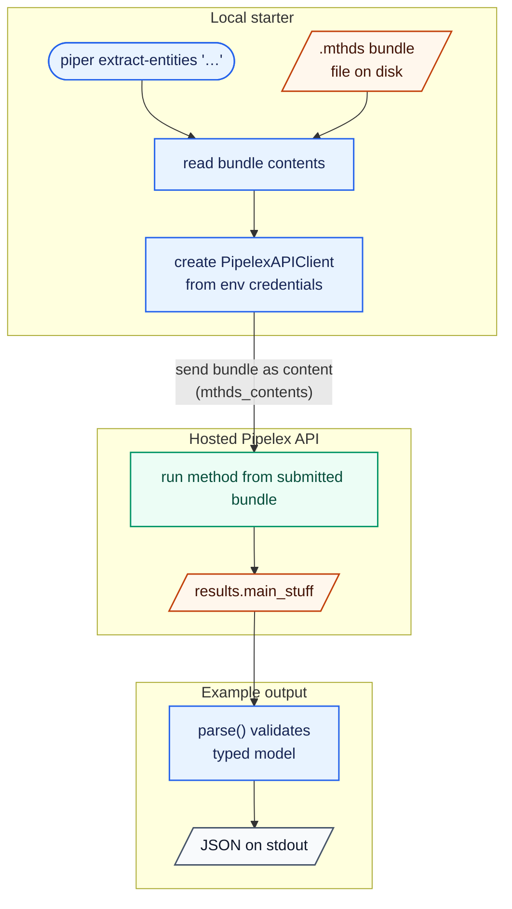
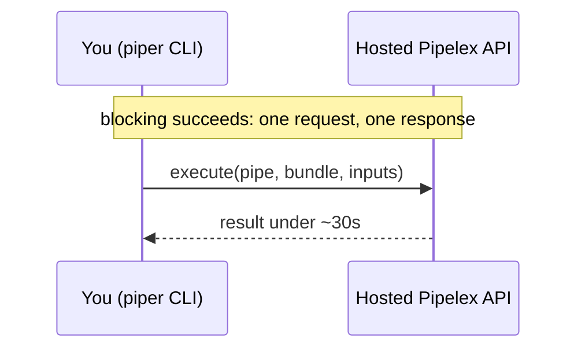
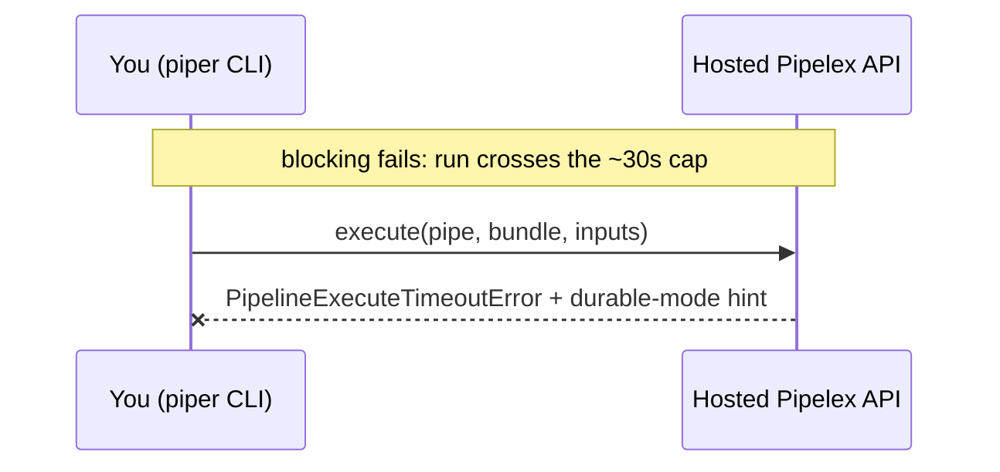
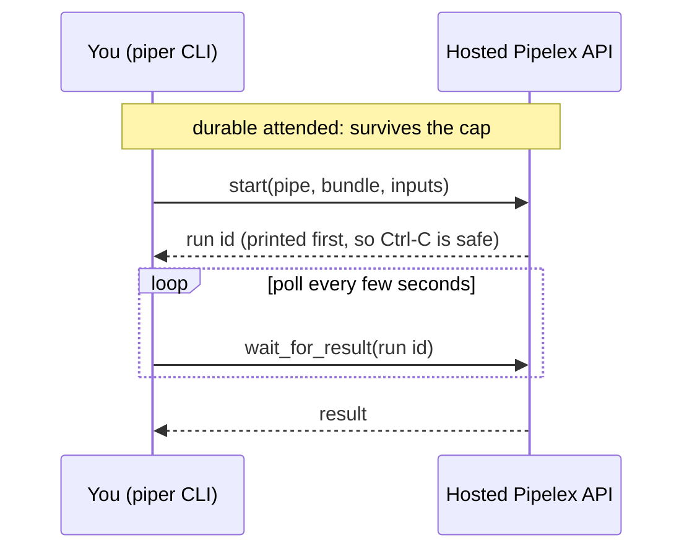
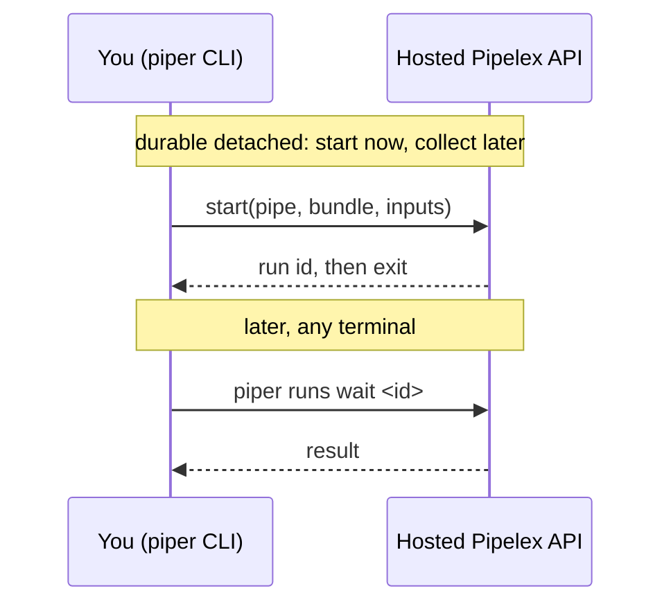

# Piper ⚡️

*Replace "Piper" with your actual project name*

A minimal Python CLI starter that calls the [Pipelex](https://pipelex.com) API via the [`pipelex-sdk`](https://pypi.org/project/pipelex-sdk/) SDK to run AI methods (`.mthds` bundles) — no local Pipelex runtime required.

It ships a handful of demo methods, each exposed as a `piper` CLI command:

- **`extract-entities`** — given a piece of text, pull out the people, organizations, and dates it mentions.
- **`summarize-pdf`** — given a document (PDF), produce a title, document type, and key points. Shows how to feed a *file* to a pipe.
- **`generate-image`** — given a text prompt, generate an image. Being slow, it's the example that best shows the durable-vs-blocking split (image generation routinely outlives the hosted ~30s blocking cap).

Each prints its result as JSON.

### Use this template

This is a template repository — don't clone it directly. Click the green **Use this template** button at the top-right of the GitHub page to create your own repo, then clone that.

**Make it yours.** The fastest path is the bundled `/bootstrap` skill: open your new repo in [Claude Code](https://claude.com/claude-code) and run `/bootstrap`. It renames the placeholder (`piper` → your project name) everywhere — the package directory, `pyproject.toml`, the CLI command, imports, README, and LICENSE — then regenerates the lock file and runs the checks. Just answer its prompts (project name, description, license).

Prefer to do it by hand? The manual equivalent:
1. In `pyproject.toml`, replace `piper` with your project name — dashes in `[project] name` and the `[project.scripts]` command, underscores in `[tool.setuptools] packages`, `[tool.mypy] packages`, and `[tool.pyright] include`.
2. Rename the `piper/` directory to your package name (underscores).
3. Update the imports across `piper/` and `tests/` to match.
4. Rewrite this README with your own project details.

## Prerequisites

Access to a **Pipelex API** server. You have two options:

- **Hosted** — currently in private beta. Join the waitlist at [go.pipelex.com/waitlist](https://go.pipelex.com/waitlist). Once you have access, get an API key at [app.pipelex.com](https://app.pipelex.com) and point `PIPELEX_BASE_URL` at `https://api.pipelex.com` (the default).
- **Self-hosted** — the Pipelex API is open source at [github.com/Pipelex/pipelex-api](https://github.com/Pipelex/pipelex-api). Run it locally or on your own infra and point `PIPELEX_BASE_URL` at your instance (e.g. `http://127.0.0.1:8081`).

## Quick start

Copy the env file and add your key:

```bash
cp .env.example .env
# set PIPELEX_API_KEY in .env (and PIPELEX_BASE_URL if you're self-hosting)
```

Install the dependencies, then run your first method. `uv run` executes a command inside this project's environment — think `npx` for Python, so there's no virtualenv to activate first:

```bash
make install                       # create the venv and install deps with uv
uv run piper extract-entities "Alice from Acme met Bob on May 3rd, 2026."
```

You get the extracted entities as JSON:

```json
{
  "people": ["Alice", "Bob"],
  "orgs": ["Acme"],
  "dates": ["May 3rd, 2026"]
}
```

A `Run started: run_…` line shows up first (on stderr) — durable mode (the default) prints the run id before polling, so a long run is never lost. Prefer a bare `piper …`? Activate the venv once with `source .venv/bin/activate` and drop the `uv run` prefix.

## Try the demos

Each demo is one `piper` command backed by one "copy me" module in `piper/examples/` — a bundle path, an output model, and a `parse()` narrower. Run them straight from the template.

**Extract entities** — text in, structured entities out.

```bash
uv run piper extract-entities "Alice from Acme met Bob on May 3rd, 2026."
uv run piper extract-entities --file notes.txt          # or read the text from a file
```

```json
{ "people": ["Alice", "Bob"], "orgs": ["Acme"], "dates": ["May 3rd, 2026"] }
```

**Summarize a PDF** — a *file* goes in; `piper` base64-encodes it into a `Document` envelope for you, so you never host the file yourself.

```bash
uv run piper summarize-pdf samples/sample-invoice.pdf
```

```json
{
  "title": "Invoice from Northwind Traders",
  "doc_type": "invoice",
  "key_points": [
    "Invoice number: INV-2026-0042",
    "Total amount due: $1,728.00",
    "Payment terms: Net 30"
  ]
}
```

**Generate an image** — the slow one, and the reason durable mode exists. Image generation routinely outlives the hosted ~30s blocking cap.

```bash
uv run piper generate-image "a fox reading under a tree"                    # durable (default): waits it out
uv run piper generate-image "a fox reading under a tree" --mode blocking    # watch it hit the ~30s cap
```

```json
{
  "url": "pipelex-storage://runs/…/image.png",
  "public_url": "https://storage.pipelex.com/…",
  "mime_type": "image/png",
  "caption": null
}
```

Open `public_url` in a browser to see the image. Run it with `--mode blocking` and you'll get a `PipelineExecuteTimeoutError` with a hint pointing you back to durable mode — that contrast is what the **Execution modes** section below is about.

## How it works

`piper extract-entities "<text>"` runs entirely through the SDK — nothing about the method lives on the server:



1. **Read the bundle.** `piper` reads `methods/extract-entities/main.mthds` from disk and constructs a `PipelexAPIClient`, which picks up `PIPELEX_BASE_URL` / `PIPELEX_API_KEY` from the environment.
2. **Run it on the API.** The bundle is sent as *content* (`mthds_contents`), so nothing method-specific needs to live in the runtime — edit the `.mthds` file and re-run, no redeploy.
3. **Narrow the result.** The SDK resolves `results.main_stuff`; the example's `parse()` validates it into the typed `ExtractedEntities` model, printed as JSON.

The typed models are **not hand-written**: they are generated from the `.mthds` bundles by `pipelex codegen` into `piper/generated/` (stamped, with a `codegen.lock` per method). Edit a bundle → `make codegen` regenerates the models and input templates → `make codegen-check` verifies offline that nothing is stale or hand-edited. See [docs/codegen.md](docs/codegen.md).

The other demos run through the exact same path — they differ only in their inputs and output shapes. `summarize-pdf` sends a `Document` envelope (`file_input.build_document_input()` base64-encodes the file into a `data:` URL); `generate-image` returns the built-in `Image` content.

## Execution modes: durable vs blocking

Every command takes `--mode` (env var `PIPELEX_EXECUTION_MODE`). The default is **durable**, and `generate-image` is the demo that shows why:

### Blocking: finishes under the cap

Blocking mode is a single `client.execute()` call. Use it when you expect the run to finish quickly:



### Blocking: times out

The same blocking call fails when the hosted gateway cap is reached:



### Durable attended: wait here

Durable attended mode starts a server-side run, prints the run id first, then keeps this terminal polling until the result is ready:



### Durable detached: collect later

Detached mode starts the same durable server-side run, then exits immediately so you can resume from any terminal:



- **blocking** — one `client.execute()` call. Simplest, but behind the hosted gateway a run over ~30s is cut off with a `PipelineExecuteTimeoutError` that points you at durable mode.
- **durable attended** (default) — `client.start()` then poll to completion (`client.wait_for_result`). Survives the cap. The run id is printed *before* polling, so a Ctrl-C leaves the run executing server-side and you can resume it with `piper runs wait <id>`.
- **durable detached** (`--detach`) — `client.start()` and return immediately. Pick the run back up later — even from another terminal — with `piper runs status|result|wait <id>`.

`piper/runner.py` branches on the mode explicitly instead of calling the SDK's `start_and_wait()` self-healing one-liner (the production shortcut when you don't care which path runs) — teaching the difference is the point of this starter.

## Project structure

```
piper/
  cli.py                         # the `piper` Typer CLI (console-script entry point)
  runner.py                      # execution-mode dispatch: blocking / durable attended / detached
  errors.py                      # maps SDK errors to CLI messages + hints
  file_input.py                  # encode a local file into a Pipelex Document input envelope
  examples/                      # one "copy me" unit per demo: bundle path + parse() over the generated model
    extract_entities.py          #   text → { people, orgs, dates }
    summarize_pdf.py             #   document → { title, doc_type, key_points }
    generate_image.py            #   prompt → image
  generated/                     # typed clients generated from the bundles (`make codegen`) — do not edit
    extract_entities/            #   models.py (stamped) + codegen.lock
    summarize_pdf/
    generate_image/
  methods/                       # the method bundles (sent to the API as content)
    extract-entities/            #   main.mthds + inputs.template.json (generated runnable template)
    summarize-pdf/
    generate-image/
samples/
  sample-invoice.pdf             # a document to try `summarize-pdf` on
tests/
  unit/                          # offline CLI / example / error-mapping tests
  integration/                   # offline boot/bundle checks + API validate (pipelex_api)
  e2e/                           # full run against the API (inference)
.env.example                     # PIPELEX_BASE_URL + PIPELEX_API_KEY
```

## Useful commands

```bash
uv run piper extract-entities "…" --detach   # start a durable run, print its id, return
uv run piper runs wait <run-id>              # resume a detached run (also: runs status | runs result)
make validate       # lint/validate the .mthds bundles with plxt (offline)
make codegen        # regenerate the typed clients + input templates from the bundles
make codegen-check  # verify the generated clients are current (offline, pure hashing)
make agent-check    # fix-imports + format + lint + pyright + mypy
make agent-test     # offline test suite (silent on success)
make test-inference # tests that hit the API (needs a key)
```

## Contact & Support

| Channel                                | Use case                                                                  |
| -------------------------------------- | ------------------------------------------------------------------------- |
| **GitHub Discussions → "Show & Tell"** | Share ideas, brainstorm, get early feedback.                              |
| **GitHub Issues**                      | Report bugs or request features.                                          |
| **Email (privacy & security)**         | [security@pipelex.com](mailto:security@pipelex.com)                       |
| **Discord**                            | Real-time chat — [https://go.pipelex.com/discord](https://go.pipelex.com/discord) |

## 📝 License

This project is licensed under the [MIT license](LICENSE). Runtime dependencies are distributed under their own licenses via PyPI.

---

*Happy piping!* 🚀
